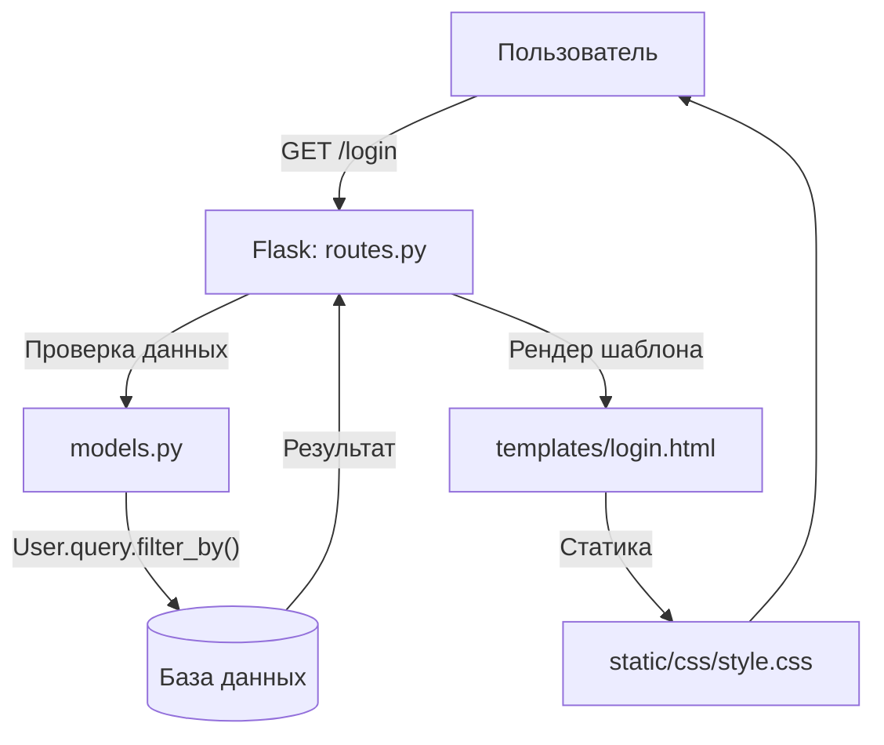

# YanLycWebProject

### **Техническое задание: "Виртуальный сад" (Flask-приложение)**

---

## **1. Общее описание**  
**Цель проекта**  
Создать мотивационное веб-приложение, которое помогает пользователям формировать полезные привычки через игровой механизм ухода за виртуальными растениями.

**Основная концепция**  
- Каждое растение в саду символизирует определенную привычку  
- При выполнении привычки (например, физические упражнения) растение получает "воду" и растет  
- Чем чаще пользователь выполняет привычку, тем быстрее развивается его виртуальный сад  

**Целевая аудитория**  
- Люди, желающие выработать полезные привычки  
- Пользователи, которым нравятся геймифицированные приложения  
- Возрастная категория: 12+  

---

## **2. Функциональные требования**  

### **2.1 Система пользователей**  
- **Регистрация**  
  - Форма с полями: имя пользователя, пароль  
  - Валидация вводимых данных  
  - Шифрование паролей (bcrypt)  
  - Создание стартового набора растений для нового пользователя  

- **Авторизация**  
  - Вход по логину/паролю  
  - Система сессий через cookies  
  - Защита от brute-force атак  

### **2.2 Виртуальный сад**  
- **База растений**  
  - Каждое растение имеет: название, описание, иконку  
  - Связь с конкретной привычкой (например: "Дуб" - "Спорт")  
  - Параметры роста: уровень, прогресс  

- **Механика ухода**  
  - Кнопка "Полить" (+10% к прогрессу)  
  - При достижении 100% - повышение уровня растения  
  - Визуальные изменения при росте  

### **2.3 Дополнительные функции**  
- Система достижений  
- Возможность добавлять собственные привычки  
- Статистика прогресса (графики)  

---

## **3. Техническая реализация**  

### **3.1 Архитектура проекта**  
```
virtual-garden/
├── app/                  # Основной модуль
│   ├── __init__.py       # Инициализация приложения
│   ├── routes.py         # Все маршруты
│   ├── models.py         # Модели БД
│   ├── forms.py          # Формы WTForms
│   └── utils.py          # Вспомогательные функции
├── migrations/           # Миграции БД
├── static/               # Статические файлы
│   ├── css/
│   ├── js/
│   └── images/
├── templates/            # Шаблоны
│   ├── base.html         # Базовый шаблон
│   ├── index.html        # Главная страница
│   ├── auth/             # Авторизация
│   │   ├── login.html
│   │   └── register.html
│   └── errors/           # Страницы ошибок
├── config.py             # Конфигурация
└── requirements.txt      # Зависимости
```

### **3.2 Технологический стек**  
| Компонент       | Технологии                          |
|-----------------|-------------------------------------|
| **Backend**     | Python 3.12, Flask 3.1.0           |
| **База данных** | SQLite (для разработки)            |
| **Фронтенд**    | HTML5, CSS3, Vanilla JS            |
| **Библиотеки**  | SQLAlchemy, WTForms, Bcrypt        |

### **3.3 Основные модули и их взаимодействие**  

